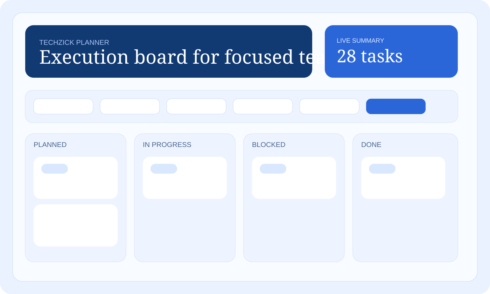
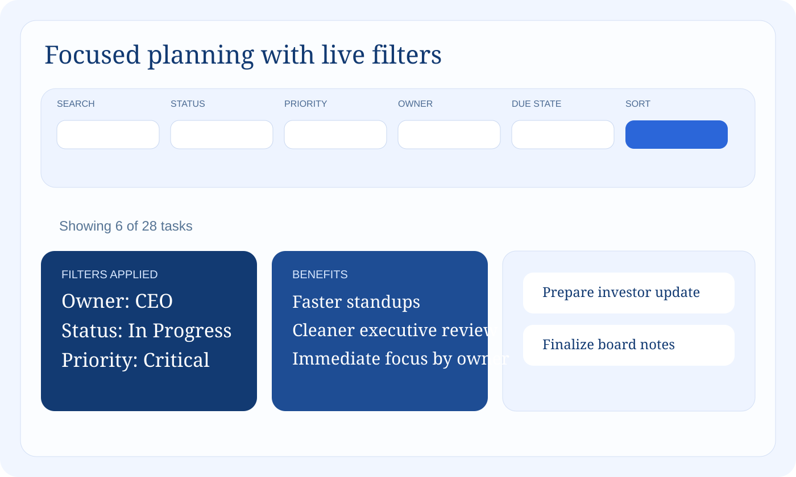

# Techzick Planner

Techzick Planner is a lightweight task planning and execution workspace for startup teams that need one place to capture, prioritize, update, and review work.

It is designed as a lean alternative to heavier planning tools such as Microsoft Planner or Microsoft Project, with a faster setup path and a cleaner operating surface for small teams.

## Screenshots

### Dashboard and board view



### Filtered planning workflow



## Features

- Kanban-style task board with status lanes
- Create, edit, and delete tasks from a single workspace
- Persistent local storage with file-backed task data
- Azure SQL support for cloud persistence
- Filters for status, priority, owner, due state, and text search
- Sort tasks by latest update, due date, priority, or title
- Summary tiles that reflect the active filtered view
- Azure-ready deployment artifacts for App Service and SQL Database

## Status Model

- `Planned`
- `In Progress`
- `Blocked`
- `Done`

## Technology Stack

- Node.js
- Express
- EJS
- Vanilla JavaScript
- CSS
- Azure App Service
- Azure SQL Database

## Project Structure

```text
.
├── .azure/                Azure planning assets
├── data/                  Local persistent task storage
├── docs/screenshots/      README visual assets
├── infra/                 Azure Bicep infrastructure
├── public/                Frontend scripts and styles
├── src/                   Server and storage logic
├── views/                 EJS templates
├── azure.yaml             AZD project configuration
└── README.md
```

## Local Setup

### Prerequisites

- Node.js 20+
- npm 10+

### Install and run

```bash
cd /Users/chanchalsharma/Desktop/Repos/TaskTracker
npm install
cp .env.example .env
npm start
```

Open:

```text
http://127.0.0.1:6000
```

## Local Configuration

Default local values are already configured in `.env.example`.

Key settings:

- `HOST=0.0.0.0`
- `PORT=6000`
- `STORAGE_PROVIDER=file`
- `DATA_FILE=./data/tasks.json`

This means tasks persist locally across restarts without requiring a database.

## How To Test

### UI flow

1. Open the app in the browser.
2. Create a task with title, owner, priority, and due date.
3. Edit the task and move it to `In Progress`.
4. Use filters to narrow by owner, status, or due state.
5. Delete a task and confirm the board updates.
6. Restart the app and confirm tasks remain saved.

### API checks

Health check:

```bash
curl http://127.0.0.1:6000/healthz
```

Fetch tasks:

```bash
curl http://127.0.0.1:6000/api/tasks
```

Create a task:

```bash
curl -X POST http://127.0.0.1:6000/api/tasks \
  -H "Content-Type: application/json" \
  -d '{
    "title":"Prepare board review",
    "description":"Consolidate weekly execution metrics",
    "status":"Planned",
    "priority":"High",
    "owner":"CEO Office",
    "dueDate":"2026-03-20"
  }'
```

## Azure Deployment Shape

The repository includes Azure deployment assets for:

- Azure App Service
- Azure SQL Database
- Azure Key Vault
- Application Insights
- Log Analytics

Relevant files:

- [azure.yaml](./azure.yaml)
- [infra/main.bicep](./infra/main.bicep)
- [infra/main.parameters.json](./infra/main.parameters.json)
- [.azure/plan.md](./.azure/plan.md)

## Persistence Model

### Local development

- Storage provider: file
- Data file: `data/tasks.json`

### Azure deployment

- Storage provider: Azure SQL Database
- Secrets handled through Azure Key Vault references

## Roadmap

- Team/project grouping
- Tags and custom labels
- Saved filter presets such as `My Tasks` and `Overdue`
- Authentication and role-based access
- Reporting and export views

## License

MIT
